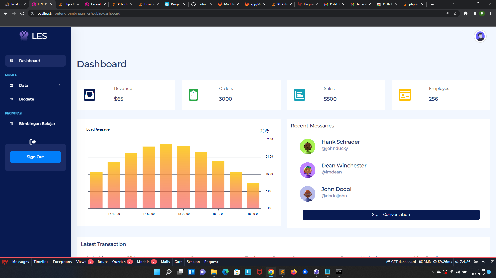
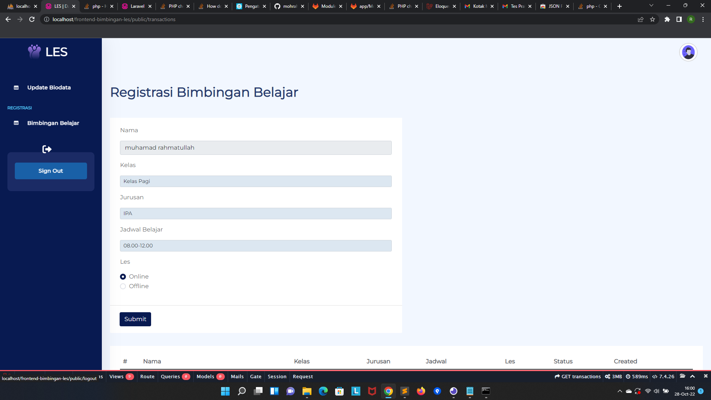

# Requirements
```
	PHP 7.4
	Laravel 8
	Mysql 5.7.36
```


# Installation

1. Clone this repo

```
git clone https://github.com/mohrahmatullah/frontend-bimbingan-les.git
```


2. Setup

```
$ cd frontend-bimbingan-les
$ composer install
$ php artisan key:generate
$ copy .env.example .env

put database credentials in .env file
```


Aplikasi Terdiri dari 2 role

```
admin
user
```

akun admin

```
username = admin
password = admin
```


## Tampilan Dashboard Admin.



## Tampilan Dashboard User.

